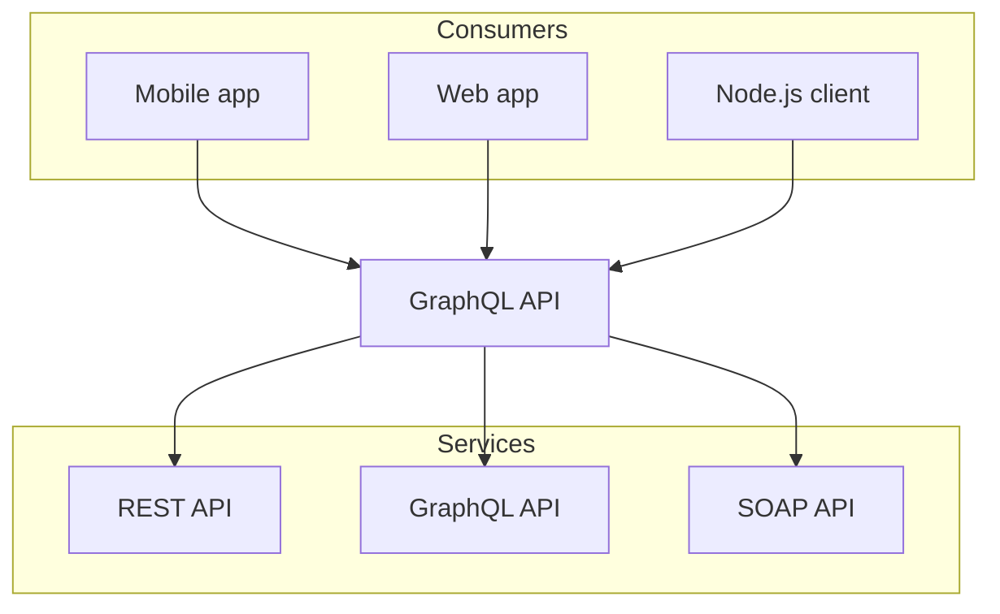

import styles from '../components/counters.module.css'
import { Callout } from 'nextra/components'
import { Bleed } from 'nextra-theme-docs'
import { Card, Cards } from 'nextra/components'
import { Tab, Tabs } from 'nextra/components'
import { CardsIcon, OneIcon, WarningIcon } from '@components/icons'
import { Steps } from 'nextra/components'
import { FileTree } from 'nextra/components'
import { useState } from 'react'

# Website Elements

# h1 Heading
H1 elements should not be used except once per page as the page title. They do not show on the sidebar. 

## h2 Heading
H2 elements have a horizontal rule under them by default.

### h3 Heading

#### h4 Heading

##### h5 Heading

###### h6 Heading

## Native Elements
These elements are available on every page and do not need an import

### Horizontal Rule 
---

Horizontal rule is created using three dashes "---". 

### Emphasis

**This is bold text**

_This is italic text_

~~Strikethrough~~

### Blockquotes

> Blockquotes can also be nested...
>
> > ...by using additional greater-than signs right next to each other...
> >
> > > ...or with spaces between arrows.

### Lists

**Unordered lists**

- Create a list by starting a line with `+`, `-`, or `*`
- This one is created with -
+ This one is created with +
* This one is created with *  

**Unordered sublists**
- Sub-lists are made by indenting 2 spaces:
  - Marker character change forces new list start:
    - Ac tristique libero volutpat at
    * Facilisis in pretium nisl aliquet
    - Nulla volutpat aliquam velit

**Ordered lists**

1. Lorem ipsum dolor sit amet
2. Consectetur adipiscing elit
3. Integer molestie lorem at massa
4. You can use sequential numbers...
5. ...or keep all the numbers as `1.`

**Ordered list with offset**

57. foo
1. bar

### Checklist
- [x] Write the press release
- [ ] Update the website
- [ ] Contact the media

### Tables

| Option | Description                                                               |
| ------ | ------------------------------------------------------------------------- |
| data   | path to data files to supply the data that will be passed into templates. |
| engine | engine to be used for processing templates. Handlebars is the default.    |
| ext    | extension to be used for dest files.                                      |

Right aligned columns

| Option |                                                               Description |
| -----: | ------------------------------------------------------------------------: |
|   data | path to data files to supply the data that will be passed into templates. |
| engine |    engine to be used for processing templates. Handlebars is the default. |
|    ext |                                      extension to be used for dest files. |

### Dynamic Tables
<table>
  <thead>
    <tr>
      <th>Country</th>
      <th>Flag</th>
    </tr>
  </thead>
  <tbody>
    {[
      { country: 'France', flag: '🇫🇷' },
      { country: 'Ukraine', flag: '🇺🇦' }
    ].map(item => (
      <tr key={item.country}>
        <td>{item.country}</td>
        <td>{item.flag}</td>
      </tr>
    ))}
  </tbody>
</table>

### Links

[link text](http://dev.nodeca.com)

[link with title](http://nodeca.github.io/pica/demo/ "title text!")

Autoconverted links:
https://github.com/nodeca/pica

www.nextjs.org

### Images

Using the \!\[\]\(\) syntax for images will automatically optimize and size images using the standards of [Next.js Image](https://nextjs.org/docs/pages/building-your-application/optimizing/images).


### Details dropdown
<details>
  <summary>Details</summary>
  <p>Something small enough to escape casual notice.</p>
</details>

### Autolinks
Any links within markdown will be automatically linked:

Visit https://nextjs.org.

### Code

Inline `code`

Inline syntax highlighting `let x = 1{:jsx}`

Indented code

```
no indent
  one indent
    two indents

    // Some comments
```

Block code "fences"

```
Sample text here...
```

Syntax highlighting

```js
var foo = function (bar) {
  return bar++;
};

console.log(foo(5));
```

Copy button and file name
```js filename="demo.js" copy
let a = 1;

console.log(a);
```

Highlight specific lines
```js {1,4-5}
import { useState } from 'react'
 
function Counter() {
  const [count, setCount] = useState(0)
  return <button onClick={() => setCount(count + 1)}>{count}</button>
}
```

Highlight substring 
```js /useState/
import { useState } from 'react'
 
function Counter() {
  const [count, setCount] = useState(0)
  return <button onClick={() => setCount(count + 1)}>{count}</button>
}
```

Line numbers
```js showLineNumbers
import { useState } from 'react'
 
function Counter() {
  const [count, setCount] = useState(0)
  return <button onClick={() => setCount(count + 1)}>{count}</button>
}
```

ANSI highlighting
```ansi
 ✓ src/index.test.ts (1)
   Test Files  1 passed (1)
        Tests  1 passed (1)
     Start at  23:32:41
     Duration  11ms
   PASS  Waiting for file changes...
         press h to show help, press q to quit
```


### Mermaid


## Nextra Components
These are Nextra components. They need to be imported onto a page they will be used on. 

### Callouts
<Callout emoji="👾">
  **Space Invaders** is a 1978 shoot 'em up arcade game developed by Tomohiro
  Nishikado.
</Callout>

<Callout type="info">
  Today is Friday.
</Callout>

<Callout type="warning">
  This API will be deprecated soon.
</Callout>

<Callout type="error">
  This is a dangerous feature that can cause everything to explode.
</Callout>

### Bleed
When wrapping your content with `<Bleed>`, it will be slightly wider than the container and will overflow on both sides.

<Bleed>
  <div className="bg-white dark:bg-neutral-800 px-16 py-10 text-center border">
    _There is nothing to writing. All you do is sit down at a typewriter and **bleed**._

    — Ernest Hemingway

  </div>
</Bleed>

It provides a better reading experience when you want to present some graphical
information, which normally looks nicer in a larger size.

For example, you can put text, image, video or any component inside:

<Bleed>
  <iframe
    className="aspect-video w-full"
    src="https://www.youtube.com/embed/3hccXiXI0u8"
    allow="accelerometer; autoplay; clipboard-write; encrypted-media; gyroscope; picture-in-picture"
    allowFullScreen
  />
</Bleed>

You can even make it full-bleed using `<Bleed full>`:
 
<Bleed full>
  
</Bleed>

### Cards
<Cards>
  <Card icon={<WarningIcon />} title="Callout" href="/docs/guide/built-ins/callout" />
  <Card icon={<CardsIcon />} title="Tabs" href="/docs/guide/built-ins/tabs" />
  <Card icon={<OneIcon />} title="Steps" href="/docs/guide/built-ins/steps" />
</Cards>

### Tabs
<Tabs items={['pnpm', 'npm', 'yarn']}>
  <Tab>**pnpm**: Fast, disk space efficient package manager.</Tab>
  <Tab>
    **npm** is a package manager for the JavaScript programming language.
  </Tab>
  <Tab>**Yarn** is a software packaging system.</Tab>
</Tabs>

### FileTree
<FileTree>
  <FileTree.Folder name="pages" defaultOpen>
    <FileTree.File name="_meta.json" />
    <FileTree.File name="contact.md" />
    <FileTree.File name="index.mdx" />
    <FileTree.Folder name="about">
      <FileTree.File name="_meta.json" />
      <FileTree.File name="legal.md" />
      <FileTree.File name="index.mdx" />
    </FileTree.Folder>
  </FileTree.Folder>
</FileTree>

### Steps
<Steps>
 
### Step 1
 
Contents for step 1.
 
### Step 2
 
Contents for step 2.
 
</Steps>


## Custom Components
These examples show how to use custom JS components. This is possible using [MDX](https://mdxjs.com/community/about/).

### JS Component
This component is defined directly on the page

export const Counter = () => {
  const [count, setCount] = useState(0);
  return (
    <div>
      <button onClick={() => setCount(count + 1)} className={styles.counter}>
        Clicked {count} times
      </button>
    </div>
  );
};

<Counter />

### External Component
This component is imported

import Counters from "../components/counters";

<Counters />


## Plugins
These will have to be enabled to work properly.

The killer feature of `markdown-it` is very effective support of
[syntax plugins](https://www.npmjs.org/browse/keyword/markdown-it-plugin).

### [Emojies](https://github.com/markdown-it/markdown-it-emoji)

> Classic markup: :wink: :crush: :cry: :tear: :laughing: :yum:
>
> Shortcuts (emoticons): :-) :-( 8-) ;)

see [how to change output](https://github.com/markdown-it/markdown-it-emoji#change-output) with twemoji.

### [Subscript](https://github.com/markdown-it/markdown-it-sub) / [Superscript](https://github.com/markdown-it/markdown-it-sup)

- 19^th^
- H~2~O

### [\<ins>](https://github.com/markdown-it/markdown-it-ins)

++Inserted text++

### [\<mark>](https://github.com/markdown-it/markdown-it-mark)

==Marked text==

### [Footnotes](https://github.com/markdown-it/markdown-it-footnote)

Footnote 1 link[^first].

Footnote 2 link[^second].

Inline footnote^[Text of inline footnote] definition.

Duplicated footnote reference[^second].

[^first]: Footnote **can have markup**

    and multiple paragraphs.

[^second]: Footnote text.

### [Definition lists](https://github.com/markdown-it/markdown-it-deflist)

_Compact style:_

Term 1
~ Definition 1

Term 2
~ Definition 2a
~ Definition 2b

### [Abbreviations](https://github.com/markdown-it/markdown-it-abbr)

This is HTML abbreviation example.

It converts "HTML", but keep intact partial entries like "xxxHTMLyyy" and so on.

\*[HTML]: Hyper Text Markup Language

### [Custom containers](https://github.com/markdown-it/markdown-it-container)

::: warning
_here be dragons_
:::

### [Typographic replacements](https://github.com/edemaine/markdown-it-replacements)

Enable typographer option to see result.

(c) (C) (r) (R) (tm) (TM) (p) (P) +-

test.. test... test..... test?..... test!....

!!!!!! ???? ,, -- ---

"Smartypants, double quotes" and 'single quotes'